# 🛡️ Simulación de Incidencias en SOC - TryHackMe

Este repositorio documenta un ejercicio práctico de simulación en un Centro de Operaciones de Seguridad (SOC), utilizando una plataforma SIEM (Splunk) y herramientas de análisis de amenazas para la detección, triaje, investigación y contención de incidentes de ciberseguridad.

---

## 📋 Resumen del Escenario
Se analizó una cola completa de alertas de seguridad correspondientes a potenciales campañas de suplantación de identidad (phishing), accesos no autorizados a URLs maliciosas y eventos de red. Cada caso fue investigado correlacionando metadatos de correo electrónico con registros de cortafuegos en Splunk para determinar su veracidad y aplicar las acciones de mitigación correspondientes.

---

## 🔍 Detalle de Alertas Investigadas

### 1. Alerta 8814: Correo con enlace externo (Onboarding de RR.HH.)
* **Tipo:** Suplantación de identidad / Phishing (Simulado)
* **Estado:** Cerrado (*Falso Positivo*)
* **Descripción:** Alerta generada por un correo entrante corporativo con un enlace externo proveniente de un socio autorizado (`onboarding@hrconnex.thrum`). Tras la verificación de los metadatos, los registros de Splunk y el contexto interno de la organización, se determinó que formaba parte de un proceso legítimo de incorporación de recursos humanos.
* **Evidencias clave:**
  * Detalles de la alerta: 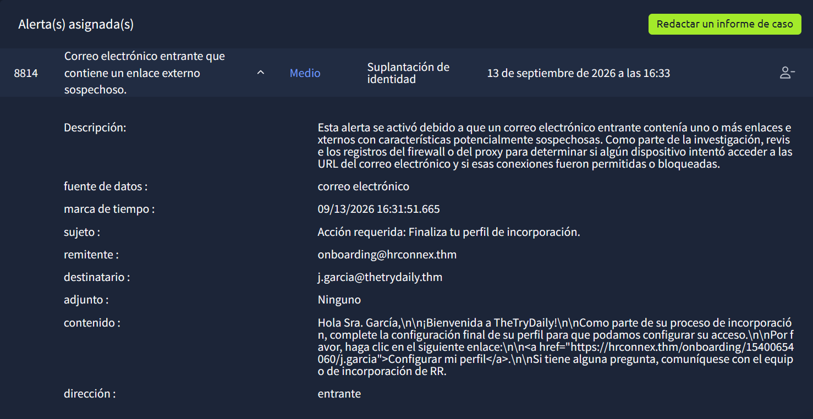
  * Correlación en Splunk: 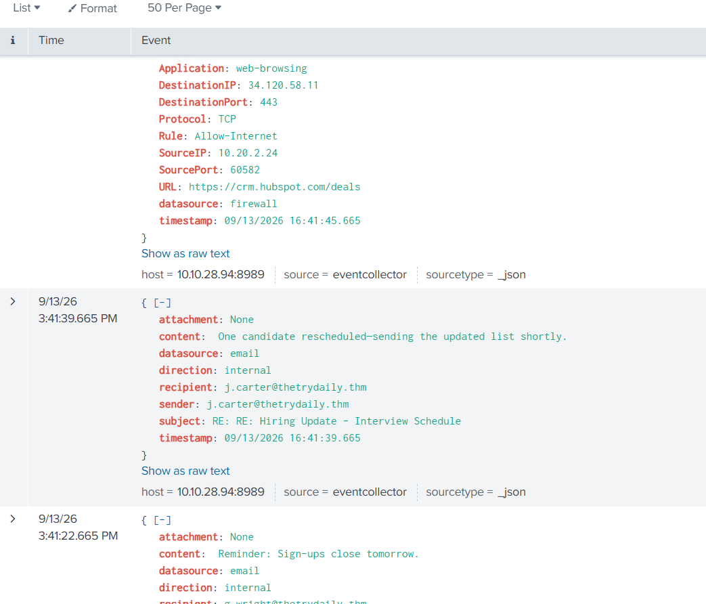
  * Informe de cierre de caso: 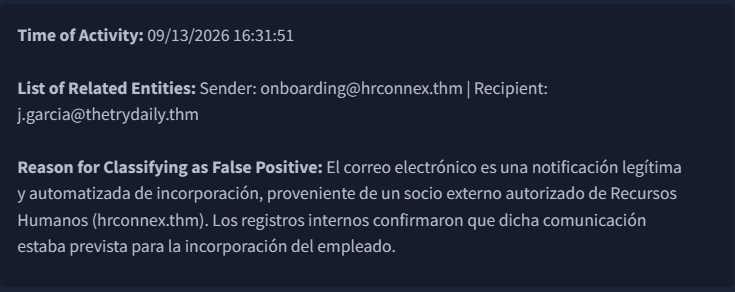
* **Clasificación:** Falso Positivo.

---

### 2. Alerta 8816: Acceso a URL externa bloqueada por cortafuegos
* **Tipo:** Cortafuegos / Tráfico Malicioso (*Gravedad: Alto*)
* **Estado:** Cerrado (*Verdadero Positivo*)
* **Descripción:** Un host interno (`10.20.2.17`) intentó acceder a un acortador de URL malicioso (`http://bit.ly/3sHkX3da12340`). El cortafuegos bloqueó la conexión de manera automática bajo la regla de "Sitios web bloqueados".
* **Evidencias clave:**
  * Detalles de la alerta y bloqueo del firewall: 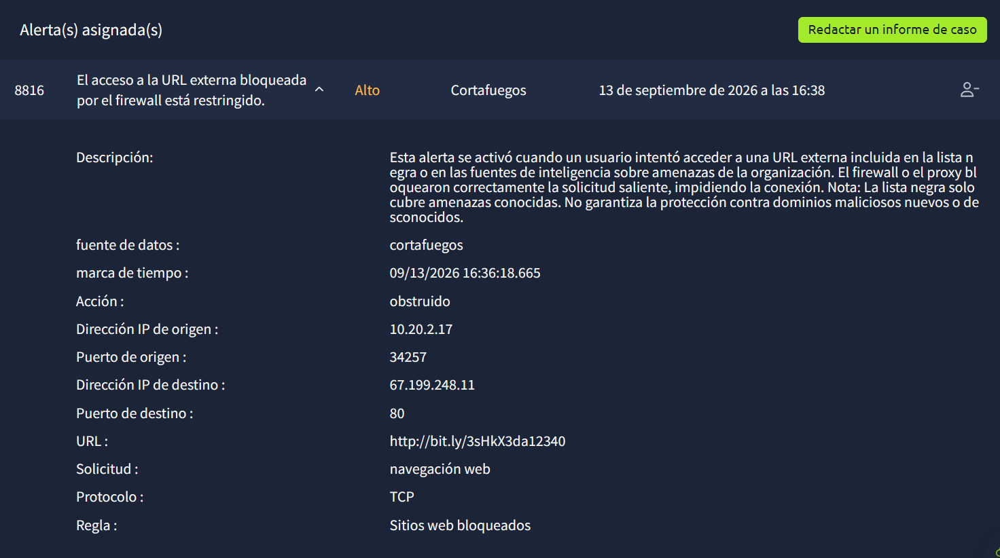
  * Análisis de reputación de la URL: 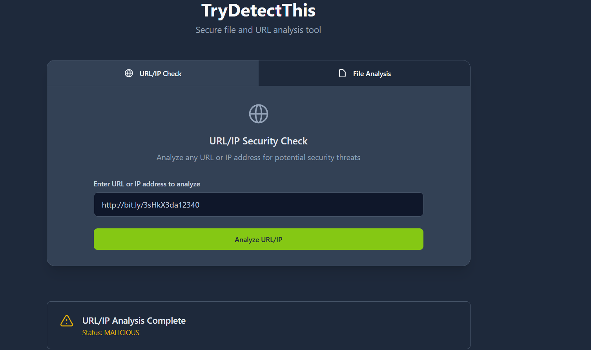
  * Informe de cierre de caso: 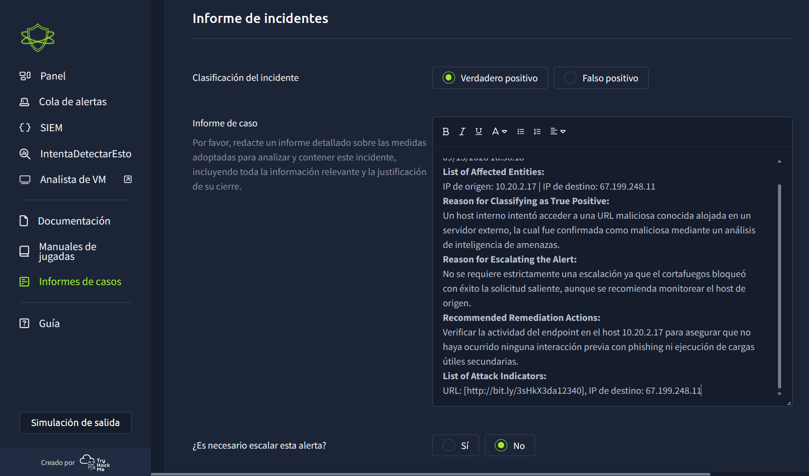
* **Acciones de remediación:** Verificación del endpoint de origen para asegurar que no existieran cargas secundarias previas.

---

### 3. Alerta 8815: Correo electrónico con enlace de phishing (Amazon)
* **Tipo:** Suplantación de identidad / Phishing
* **Estado:** Cerrado (*Verdadero Positivo*)
* **Descripción:** Recepción de un correo malicioso simulando una alerta de entrega de paquetes de Amazon (`urgentes@amazon.biz`), conteniendo la misma URL maliciosa analizada en el caso anterior. La correlación en Splunk confirmó el intento de salida y su respectivo bloqueo en el cortafuegos.
* **Evidencias clave:**
  * Detalles del correo de phishing: 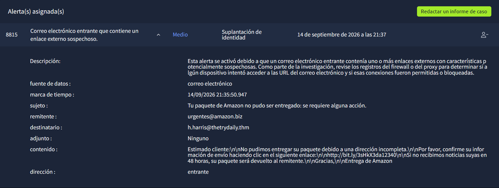
  * Correlación y bloqueo en Splunk: 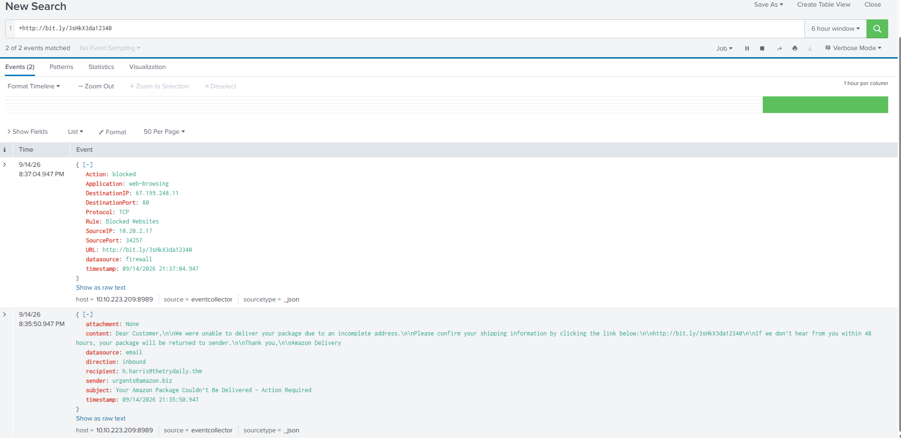
  * Informe de cierre de caso: 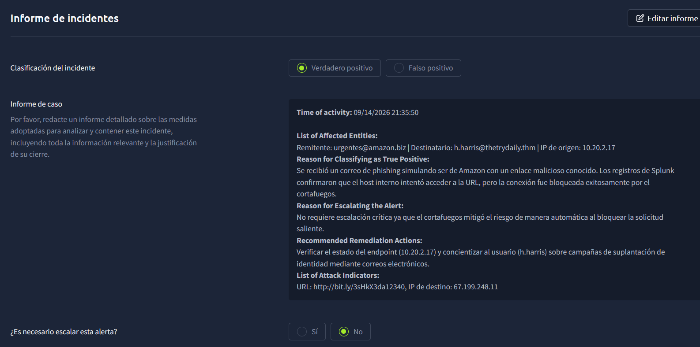

---

### 4. Alerta 8817: Correo de phishing de credenciales de Microsoft
* **Tipo:** Suplantación de identidad / Phishing Crítico
* **Estado:** Cerrado (*Verdadero Positivo - Escalado*)
* **Descripción:** Correo de suplantación de identidad simulando una alerta de seguridad de Microsoft (`no-reply@micosoftsupport.co`) dirigido al usuario `c.allen@thetrydaily.thm`. A diferencia de los casos anteriores, los registros de Splunk evidenciaron que el tráfico hacia la IP externa del atacante (`45.148.10.131`) fue **permitido** (`allowed`).
* **Evidencias clave:**
  * Detalles del correo malicioso: 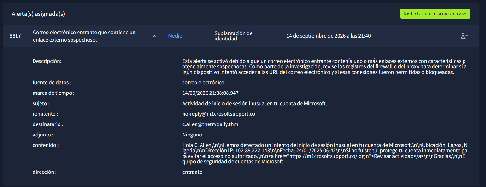
  * Registro en Splunk (Tráfico permitido): 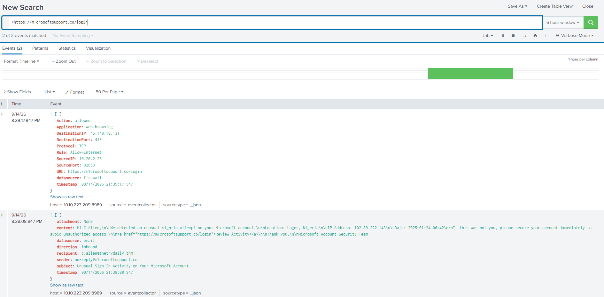
  * Informe de cierre e incidente escalado: 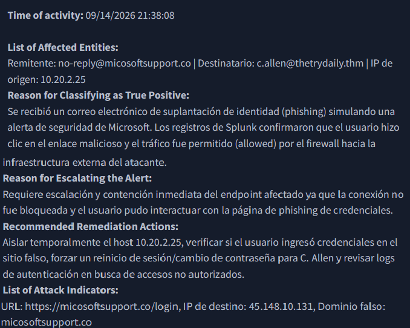
* **Acciones de remediación:** Aislamiento temporal del host afectado (`10.20.2.25`), verificación de credenciales comprometidas y solicitud de cambio de contraseña forzado.

---

## 🛠️ Herramientas y Tecnologías Utilizadas
* **SIEM:** Splunk (búsqueda de logs, análisis de eventos de firewall y correos electrónicos).
* **Threat Intelligence / Análisis:** Herramientas de reputación de URL y motores de análisis.
* **Plataforma de Simulación:** TryHackMe SOC Simulator.
